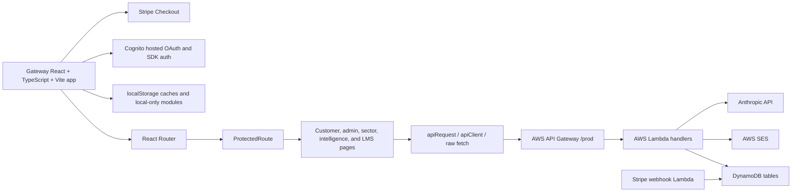

# Architecture

## Purpose

This repository contains the client-facing Nexum Suum Facility Intelligence SaaS platform. In the future product boundary model, this repository is the basis for **Gateway**: the customer portal for operational data capture, onboarding, role dashboards, tier-based intelligence, facility intelligence modules, and integrations.

Boundary definitions used across these documents:

- **Gateway**: client-facing Facility Intelligence SaaS platform with operational data capture, role dashboards, onboarding, tier-based intelligence, Drift Intelligence, Operational DNA, Observation Journal, Facility Memory, compliance/climate intelligence, and BMS/BAS/CMMS integrations.
- **Facility Compass HQ**: internal Nexum Suum consulting, CRM, billing, assessment, report-generation, license oversight, and admin orchestration platform.
- **CTS Institute**: education, publications, courses, roundtables, certifications, and community.

## Current High-Level Architecture

## Frontend Stack

- React 18.
- TypeScript.
- Vite.
- React Router v6.
- TanStack React Query, present but not consistently used as the primary data layer.
- shadcn/Radix UI component primitives.
- Tailwind CSS.
- localStorage-backed modules for offline, cache, demo, and some operational state.

## Entry Points

- `src/main.tsx`: creates the React root, wraps the router with `RetailProvider`, and imports global CSS.
- `src/App.tsx`: application shell. Provides React Query, authentication, role context, tooltips, toasts, demo panel, error boundary, and background service startup.
- `src/router.tsx`: central route table.

## Providers And Global Runtime Behavior

Current provider stack:

- `RetailProvider`
- `QueryClientProvider`
- `AuthProvider`
- `RoleProvider`
- `TooltipProvider`
- Toaster/Sonner notification surfaces
- `DemoPanel`
- Route outlet

Startup side effects in `App.tsx`:

- Starts sync listeners.
- Seeds baselines from local facility logs.
- Starts BMS polling service.
- Runs HVAC auto-derivation.
- Listens for `facility-log-submitted` and then runs correlation, observation processing, and HVAC derivation.

## Routing Structure

Public routes:

- `/login`
- `/register`
- `/verify-email`
- `/auth/callback`
- `/pricing`
- `/welcome`
- `/onboarding`

Protected route root:

- `/`

Protected child routes include dashboards, command hub, equipment, compliance, intelligence centers, government modules, retail modules, admin pages, LMS pages, and internal workspace pages.

## State Management

State is distributed across:

- React component state.
- Context providers.
- React Query.
- localStorage.
- sessionStorage.
- Backend API/DynamoDB state.

Important localStorage keys include:

- `nexum_access_token`
- `nexum_id_token`
- `nexum_refresh_token`
- `nexum_auth_tokens`
- `nexum_org_type`
- `nexum_active_facility_id`
- `nexum_active_facility_name`
- `nexum_facility_logs`
- `nexum_bms_live_data`
- `nexum_energy_bms_data`
- `nexum_climate_bms_data`
- `nexum_system_observations`
- `nexum_dept_budgets`
- `compliance_docs`

## Service Layer

The current app uses several API patterns:

- `src/lib/api.ts`: primary `apiRequest` wrapper. Adds bearer auth and throws on non-OK responses.
- `src/auth/apiClient.ts`: alternate API client that returns `{ data, error, status }`.
- `src/lib/nexum-api.ts`: large typed service facade for many backend endpoints.
- `src/lib/command-hub/workOrderService.ts`: work order-specific service wrapper.
- Raw `fetch` calls in many pages and components.

## Backend Layout

The `lambda/` directory contains colocated Lambda source files and deployment scripts. It covers a large portion of the platform but does not clearly cover every client-called route.

Current backend pattern:

- API Gateway HTTP API.
- Lambda proxy integrations.
- Cognito JWT authorizer for most customer/admin routes.
- API-key-like flow for BMS ingest.
- DynamoDB tables per domain or module.
- SES for email workflows.
- Stripe API/webhook for payments.
- Anthropic API for selected AI workflows.

## Product Boundary Interpretation

Current repository mixes all three future product boundaries:

- Gateway: client-facing SaaS pages and APIs, including operational capture, onboarding, dashboards, tier-based intelligence, Drift Intelligence, Operational DNA, Observation Journal, Facility Memory, compliance/climate intelligence, and BMS/BAS/CMMS integrations.
- Facility Compass HQ: workspace, admin, consulting, CRM, licenses, FIAS, pilots, prospects, billing, report generation, assessment workflows, and internal orchestration.
- CTS Institute: courses, LMS, Apprentice LMS, enrollments, certificates, publications, roundtables, community, and methods/course content.

No separation has been implemented yet. The recommended path is to document and classify ownership first, then split route and API ownership without moving production code until approved. HQ should receive summaries, metadata, usage, entitlement status, and authorized assessment context from Gateway; it should not receive every detailed operational log by default.
