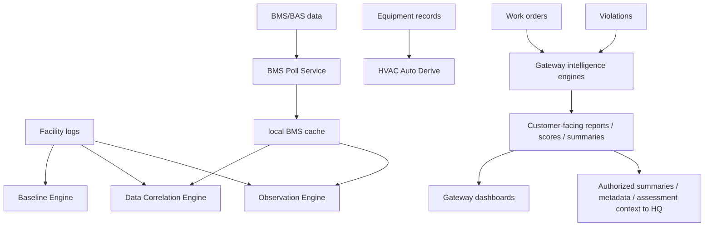

# Intelligence Engine Map

## Purpose

This document maps current intelligence engines, what triggers them, what they read, what they write, and the recommended product boundary.

## Boundary Definitions

- **Gateway**: client-facing Facility Intelligence SaaS platform with operational data capture, role dashboards, onboarding, tier-based intelligence, Drift Intelligence, Operational DNA, Observation Journal, Facility Memory, compliance/climate intelligence, and BMS/BAS/CMMS integrations.
- **Facility Compass HQ**: internal Nexum Suum consulting, CRM, billing, assessment, report-generation, license oversight, and admin orchestration platform.
- **CTS Institute**: education, publications, courses, roundtables, certifications, and community.

Gateway keeps its client-facing intelligence modules. HQ may receive summaries, metadata, usage, entitlement status, and authorized assessment context, but detailed operational logs stay in Gateway unless explicitly authorized for an assessment or report.

## Browser-Side Engines

| Engine | Location | Trigger | Reads | Writes | Recommended owner |
|---|---|---|---|---|---|
| Baseline Engine | `src/services/BaselineEngine.ts` | App startup, facility log history | `nexum_facility_logs` | `nexum_baselines` | Gateway |
| BMS Poll Service | `src/services/BMSPollService.ts` | App startup, 3-hour interval, manual trigger | `/bms/feeds`, `/skids`, auth tokens | `nexum_bms_live_data`, climate/energy BMS data, facility logs | Gateway |
| Data Correlation Engine | `src/services/DataCorrelationEngine.ts` | `facility-log-submitted` event | BMS data, local facility logs, climate/energy data | correlation summary, event `nexum_correlation_update` | Gateway |
| Observation Engine | `src/services/ObservationEngine.ts` | Manual log event, BMS/energy patterns | local logs, BMS, climate, energy | `nexum_system_observations` | Gateway |
| Vendor Intelligence Engine | `src/services/VendorIntelligenceEngine.ts` | Page/module calls | vendor/work/history data | local vendor intelligence summary | Gateway + HQ shared |
| HVAC Auto Derive | `src/lib/hvacAutoDerive.ts` | App startup, log submitted, equipment updated | local equipment/log data | `nexum_hvac_derived` | Gateway |
| Energy Engine | `src/lib/energy-engine.ts` | Energy dashboard actions/render | readings, events, cost config, violations, observations, BMS | local energy metrics and CTS insights | Gateway |
| Retail Engine | `src/lib/retail-engine.ts` | Retail dashboard actions/render | retail inventory, shrink, food safety, compliance, vendors, tasks | retail CTS/executive summaries | Gateway |
| Property Engine | `src/lib/property-engine.ts` | Property dashboard actions/render | rent, expenses, maintenance, capex, compliance | property intelligence and CTS summaries | Gateway |
| Operational Intelligence Engine | `src/lib/operationalIntelligenceEngine.ts` | Operational intelligence page | logs, work orders, equipment, violations | analysis result object | Gateway client-facing intelligence |
| Downtime Analysis Engine | `src/lib/downtimeAnalysisEngine.ts` | Downtime/OI workflows | logs, work orders, violations, equipment | downtime analysis output | Gateway client-facing intelligence |
| Depreciation Engine | `src/lib/depreciationEngine.ts` | Cost/equipment views | equipment data | lifecycle/depreciation calculations | Gateway client-facing intelligence, HQ report context when authorized |
| GovCon Quote Engine | `src/services/GovConQuoteEngine.ts` | Quote workflow | quote form inputs | `nexum_govcon_quotes` | Facility Compass HQ |
| Equipment Photo Analysis | `src/lib/equipmentPhotoAnalysis.ts` | Photo analysis panel | image input, inventory, observations | local photo records, inventory, observations | Gateway client-facing intelligence; AI secret handling should move server-side |

## Lambda/API Intelligence Engines

| Engine/API | Lambda | Trigger | Reads | Writes | Recommended owner |
|---|---|---|---|---|---|
| VVFI/FIAS | `fi-vvfi.mjs` | `/vvfi` API calls | assessment payloads, Anthropic | `NexumFIASAssessments` | Facility Compass HQ |
| Observation Journal AI | `fi-observation-journal.mjs` | `/observations/ai-summary` | observations/events, Anthropic | narrative/summary response, observation events | Gateway client-facing intelligence, HQ context when authorized |
| Work Integrity | `fi-work-integrity.mjs` | `/work-integrity/*` | work tasks, violations, Anthropic | work integrity tasks/performance/critique | Gateway client-facing intelligence, HQ report context when authorized |
| Facility Memory | `fi-facility-memory.mjs` | `/facility-memory/ingest`, page calls | work orders, violations | `NexumFacilityMemory` | Gateway client-facing intelligence, HQ assessment context when authorized |
| Operational DNA | `fi-operational-dna.mjs` | `/operational-dna/analyze` | work orders, violations | `NexumOperationalDNA` | Gateway client-facing intelligence, HQ assessment context when authorized |
| Event Integrity | `fi-event-integrity.mjs` | `/event-integrity/audit` | work orders, violations, logs | `NexumEventIntegrity`, `NexumIntegritySnapshots` | Gateway client-facing intelligence, HQ report context when authorized |
| Drift Intelligence | `fi-drift-intelligence.mjs` | `/drift-intelligence/analyze` | readings, work orders, violations | `NexumDriftAnalysis`, `NexumDriftReadings` | Gateway client-facing intelligence, HQ assessment context when authorized |
| System Violations | `fi-system-violations.mjs` | `/system-violations` | system violation records, observations, DC vault | `NexumSystemViolations` | Gateway |
| Decision Continuity Vault | `fi-dc-vault.mjs` | `/dc-vault` APIs | decision chains/signals | `NexumDCVault` | Shared Gateway/HQ |
| Risk Engine | `fi-risk-engine.mjs` | `/risk/*`, `/suggestions/*` | work orders, thresholds, acceptances | risk thresholds, acceptance, suggestions | Gateway client-facing intelligence, HQ oversight/config |
| Cost Intelligence | `fi-cost-intelligence.mjs` | `/costs/*` | transactions, valuations | cost summaries, depreciation, valuations | Gateway client-facing intelligence, HQ billing/report context when authorized |
| Resource Planning | `fi-resource-planning.mjs` | `/resources/*` | work orders, inventory, equipment | vendor/part planning overlays | Shared |
| Quality Intelligence | `quality-intelligence.mjs` | `/quality-intelligence` | quality snapshot payloads | `NexumQualityIntelligence` | Shared |

## Intelligence Data Flow

## Boundary Recommendation

- Gateway owns client-facing intelligence modules, including Drift Intelligence, Operational DNA, Observation Journal, Facility Memory, compliance/climate intelligence, and tier-based intelligence.
- HQ owns internal consulting, CRM, billing, assessment, report-generation, license oversight, and admin orchestration workflows.
- HQ receives summaries, metadata, usage, entitlement status, and authorized assessment context from Gateway rather than every detailed operational log by default.
- CTS owns educational interpretation of methods, course recommendations, publications, roundtables, certifications, and community logic.

## Current Risks

- Some engines write only to localStorage even when outputs look operationally important.
- Some AI-like functionality is browser-side.
- Engines are started globally in the app shell, so customer navigation can trigger background behavior unrelated to the active page.
- Intelligence outputs do not yet share one report registry or evidence manifest.
