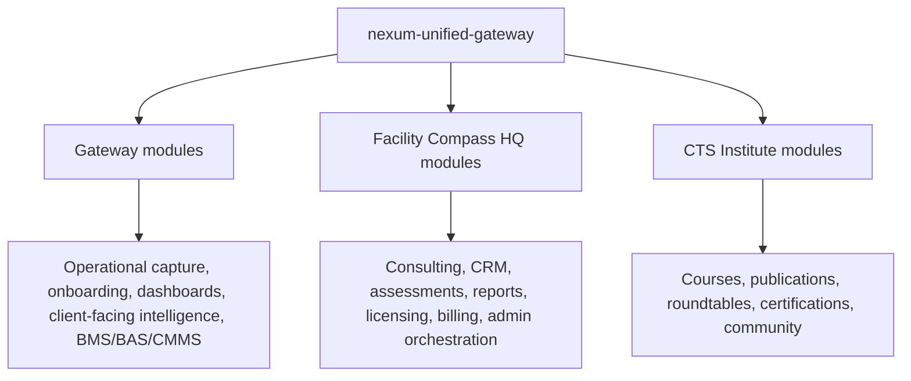
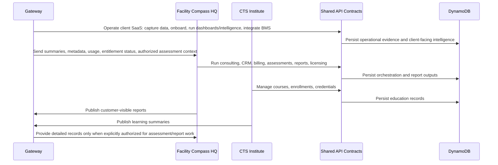

# Product Boundaries

## Purpose

This document defines the target product separation model. It does not move files or change code.

## Boundary Definitions

### Gateway

Gateway is the client-facing Facility Intelligence SaaS platform. It includes operational data capture, role dashboards, onboarding, tier-based intelligence, Drift Intelligence, Operational DNA, Observation Journal, Facility Memory, compliance/climate intelligence, and BMS/BAS/CMMS integrations.

Gateway should answer:

- What happened in the facility?
- Who did what, when, and why?
- What assets, work orders, violations, readings, documents, and messages exist?
- What client-facing intelligence should the organization see and act on?

### Facility Compass HQ

Facility Compass HQ is the internal Nexum Suum consulting, CRM, billing, assessment, report-generation, license oversight, and admin orchestration platform.

HQ should answer:

- Who is the client?
- What have they purchased?
- What assessments and reports has Nexum generated?
- What pilots, licenses, invoices, bookings, leads, and internal workflows exist?
- What summaries, metadata, usage, entitlement status, and authorized assessment context are needed to support consulting, assessments, reports, licensing, and billing?

### CTS Institute

CTS Institute is education, publications, courses, roundtables, certifications, community, and Nexum Suum methods.

CTS should answer:

- What should users learn?
- What methods, publications, courses, and certifications are available?
- Who is enrolled, certified, or progressing?
- What educational/community experience should the member receive?

## Current Repository Boundary Mix

## Gateway Ownership

Gateway should own:

- Customer dashboards.
- Role dashboards.
- Customer onboarding.
- Tier-based intelligence.
- Equipment and asset data.
- Inventory and parts.
- Facility logs and field logging.
- Work orders.
- Violations and compliance logging.
- Audit report display and customer-created reports.
- BMS/BAS/CMMS ingestion and display.
- Messages and command hub workflows.
- Client-facing intelligence modules: Drift Intelligence, Operational DNA, Observation Journal, Facility Memory, compliance intelligence, climate intelligence, and related intelligence dashboards.
- Evidence boards and decision continuity customer records.

Gateway should not own:

- Nexum internal admin workspace.
- License administration.
- Billing operations.
- Prospect buyer workflows.
- Cross-client report generation.
- Course publishing and certification operations.
- Unrestricted replication of every detailed customer operational log into internal HQ systems.

## Facility Compass HQ Ownership

HQ should own:

- Client profiles and CRM records.
- License and tier management.
- Billing and invoice operations.
- Stripe checkout orchestration and webhook follow-up.
- Pilot applications and approvals.
- Prospect buyer records.
- Lead pipeline and bookings.
- FIAS/VVFI assessment administration.
- Internal report generation.
- Internal intelligence engine orchestration.
- Admin email/SMS workflows.
- Implementation/onboarding operations.

HQ may receive summaries, metadata, usage, entitlement status, and authorized assessment context from Gateway. HQ should not receive every detailed operational log by default. HQ may write outputs back to Gateway-owned records when those outputs are customer-visible and authorized.

## CTS Institute Ownership

CTS should own:

- Courses.
- Course content.
- Apprentice LMS.
- Optimize & Learn.
- Enrollments.
- Training assignments.
- Quizzes and exams.
- Completion certificates.
- Publications and methods.
- Roundtables.
- Member community.
- Certifications and credential records.

Gateway may display learning status summaries, but CTS should own the source of truth.

## Shared Contracts

These boundaries need shared contracts:

- Identity and user profile.
- Organization and facility identifiers.
- Subscription/tier entitlements.
- Customer-visible intelligence outputs.
- Assessment/report handoff from HQ to Gateway.
- Course/enrollment summary from CTS to Gateway/HQ.
- Audit trail and defensible evidence references.

## Recommended Future Data Flow

## Separation Principles

1. Preserve all current functionality first.
2. Add ownership labels before moving code.
3. Split API clients by ownership before splitting deployments.
4. Keep shared identity and contracts stable.
5. Move admin/internal screens out of the customer surface only after route-level permissions are centralized.
6. Keep Gateway as the client-facing Facility Intelligence SaaS, including onboarding, dashboards, integrations, and client-facing intelligence modules.
7. Keep HQ focused on internal consulting, CRM, billing, assessments, report generation, license oversight, and admin orchestration.
8. Keep CTS focused on education, publications, courses, roundtables, certifications, and community.
